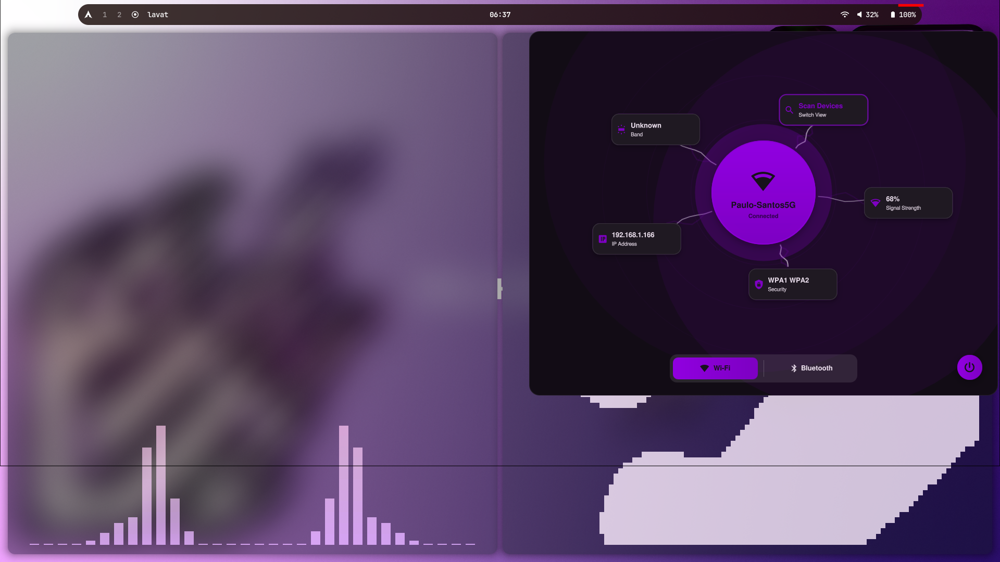
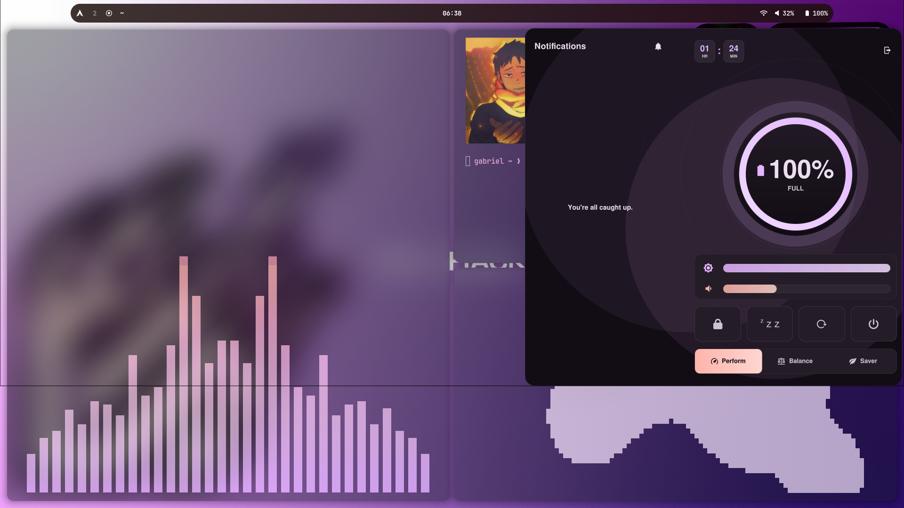
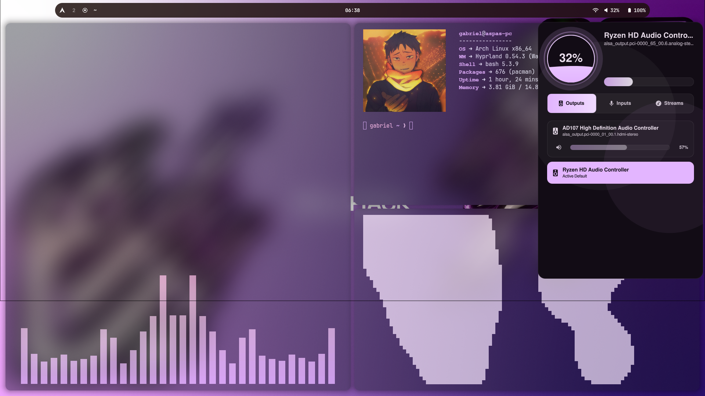

# Rice-Arch 🍚

Bem-vindo ao meu setup pessoal do Arch Linux. 
Foquei-me num design minimalista, com vidro (glassmorphism), cores que se adaptam automaticamente ao wallpaper e controlos nativos fluidos. Tudo foi pensado para ser rápido, leve e agradável de usar.

### 👀 Previews

Aqui estão algumas prints do ambiente:

**Popups de Sistema (Quickshell):**

<p align="center">
  
  
  
</p>

**Demonstração do Terminal e Animações (com som):**

Aqui podes ver o terminal em ação (abre o vídeo para ouvir o som personalizado ao abrir e fechar o Kitty):

https://github.com/GabrielVieiraHen/Rice-Arch/assets/screenshots/video.mp4

*(Se o vídeo acima não carregar, clica [aqui](screenshots/video.mp4) para o veres diretamente).*

---

### ✨ Features
- **Gestor de Janelas:** Hyprland (rápido e fluido)
- **Barra:** Waybar (transparente e responsiva)
- **Painéis de Controlo:** Quickshell (estilo nativo com sliders de volume, menus de rede e bateria)
- **Cores Dinâmicas:** Matugen (todas as cores do sistema, do terminal ao CAVA, mudam consoante o teu wallpaper automaticamente)
- **Terminal:** Kitty (com Fastfetch minimalista e um som subtil ao abrir/fechar)
- **Visualizador de Áudio:** CAVA e Lavat (com as cores extraídas pela paleta do wallpaper)

---

### 🚀 Instalação Rápida

Se quiseres usar este setup no teu Arch, criei um script que faz quase tudo por ti. Ele instala as dependências necessárias e copia os ficheiros.

1. Abre o teu terminal e clona o repositório:
```bash
git clone https://github.com/GabrielVieiraHen/Rice-Arch.git
cd Rice-Arch
```

2. Executa o instalador mágico:
```bash
chmod +x install.sh
./install.sh
```

> **Aviso:** O script faz backup da tua pasta `~/.config` atual para `~/.config-backup`, mas confirma sempre os teus ficheiros importantes antes de correr!

---

Sente-te à vontade para explorar os dotfiles, modificar ao teu gosto ou usar partes disto no teu próprio setup!
