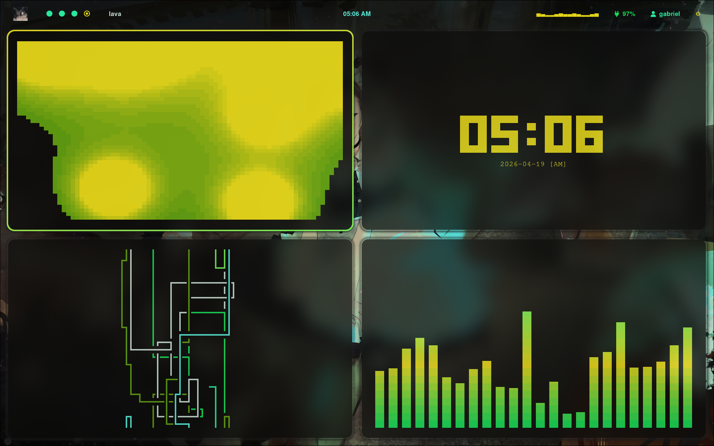

# bora ve aonde vai chegar esse rice

Um setup minimalista, ultra-rápido e agressivo para Arch Linux, focado em performance para jogos e estética Dark/Neon.



## Destaques peguei as fonte com ia
- **Window Manager:** [Hyprland](https://hyprland.org/) (Bordas Neon Animadas)
- **Barra:** [Waybar](https://github.com/Alexays/Waybar) (Design flutuante e minimalista)
- **Terminal:** [Kitty](https://sw.kovidgoyal.net/kitty/) (Configurado para baixa latência em jogos)
- **Cores:** [Pywal](https://github.com/dylanaraps/pywal) (Sincronia total entre wallpaper, janelas e apps)
- **Aesthetic:** `tty-clock` e `lavat` integrados com a paleta dinâmica.
  
## 🛠️ Comandos e Atalhos Customizados
- `SUPER + SHIFT + F`: Força qualquer jogo a entrar em Fullscreen Nativo (Latência zero, sem tela piscando).
- `SUPER + CTRL + SHIFT + Setas`: Move a janela atual para outra área de trabalho.
- `clock`: Relógio grande e centralizado no terminal.
- `lava`: Luminária de lava com efeitos de gravidade e cores dinâmicas.

## 🎮 Extreme Game Mode & Energia
A Waybar possui dois botões exclusivos para controle total do hardware:
- **Seletor de Energia (Raio/Folha):** Alterna instantaneamente a CPU entre Performance, Balanced e Power-Saver.
- **Game Mode ():** Um interruptor que desliga TODAS as transparências, blur, animações e arredondamentos. O sistema trava as cores em **Verde Neon e Preto** e engata o Feral GameMode globalmente para dedicar 100% da máquina ao jogo.

## 🎨 maioria eu editei, o wlogout peguei de um github pub
O sistema gera automaticamente a paleta de cores baseada no wallpaper atual:
- **Janelas:** Bordas com gradiente neon (Red/Pink).
- **Cava:** Visualizador de áudio com gradiente sincronizado.
- **Waybar:** Totalmente transparente para foco total no wallpaper.

## 📦 Instalação

1. Clone o repositório:
   ```bash
   git clone https://github.com/GabrielVieiraHen/Rice-Arch.git
   ```

2. Aplique as configurações (faça backup das suas antes!):
   ```bash
   cp -r .config/* ~/.config/
   cp .bashrc ~/
   ```

3. Recarregue o sistema:
   ```bash
   hyprctl reload
   ```

---
*Desenvolvido com foco em estética minimalista e performance máxima.*
